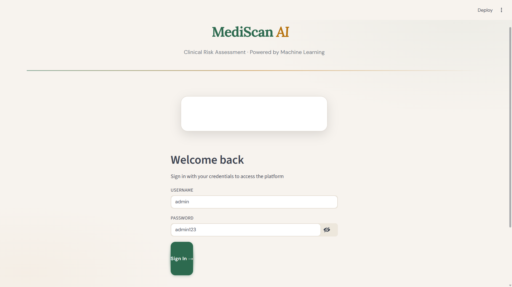
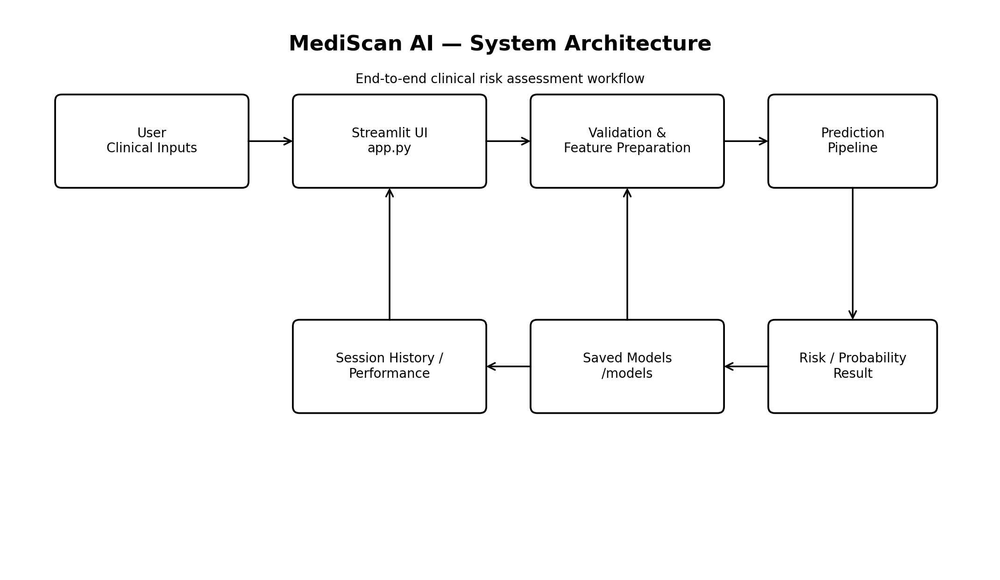

# 🩺 MediScan AI — Early Disease Detection

<p align="center">
  <strong>AI-powered multi-disease clinical risk assessment built with Python, Scikit-learn and Streamlit.</strong>
</p>

<p align="center">
  <a href="https://earlydiseasedetection-7jqksvxcqvy3c8c9hyrgfi.streamlit.app/"></a>
  <a href="https://github.com/AkashdeepPahan/Early_Disease_Detection"></a>
  
  
</p>

<p align="center">
  <em>Four disease modules • Saved ML pipelines • Probability-aware predictions • Interactive Streamlit dashboard</em>
</p>

---

## 🌐 Live Application

### [🚀 Launch MediScan AI](https://earlydiseasedetection-7jqksvxcqvy3c8c9hyrgfi.streamlit.app/)

MediScan AI is deployed on Streamlit Community Cloud and can be accessed directly from a browser.

---

## 📸 Interface Preview

<p align="center">
  
</p>

> The dashboard provides disease selection, clinical parameter input, prediction results, session history and model-performance views.

---

## 🧠 What is MediScan AI?

**MediScan AI** is an end-to-end machine learning project that demonstrates how predictive models can be integrated into an interactive healthcare-oriented web application.

The application provides preliminary risk assessments for:

| Module | Purpose |
|---|---|
| 🫀 **Heart Disease** | Cardiovascular risk assessment |
| 🩸 **Diabetes** | Diabetes risk assessment |
| 🎗️ **Breast Cancer** | Breast cancer classification |
| 🫘 **Kidney Disease** | Kidney disease risk assessment |

Instead of requiring users to interact with notebooks or Python scripts, MediScan AI wraps the trained models in a clean Streamlit interface.

---

## ✨ Key Features

### 🏥 Multi-Disease Assessment
Switch between four independent disease prediction modules from the sidebar.

### 🤖 Machine Learning Pipeline
The project evaluates multiple classification algorithms and stores trained model artifacts for inference.

Models used across the project include:

- Logistic Regression
- Random Forest
- Decision Tree
- Support Vector Machine (SVM)
- K-Nearest Neighbors (KNN)
- Gradient Boosting
- XGBoost

### 📊 Probability & Risk Results
Where supported by the trained estimator, the interface exposes prediction probability information alongside the classification result.

### 📈 Model Performance
The application includes model-performance information and visualizations for evaluating the trained pipelines.

### 🧾 Prediction History
Predictions made during the current Streamlit session can be reviewed from the history section.

### 📦 Batch Prediction
Compatible datasets can be processed through the application's batch prediction workflow.

### 📄 Report Generation
`generate_report.py` provides a utility for generating the project report.

### 🔁 Model Retraining
`retrain_models.py` provides a reproducible entry point for rebuilding saved model artifacts.

### ☁️ Cloud Ready
The repository contains the Streamlit configuration, dependency file and saved model artifacts required for cloud deployment.

---

## 🏗️ Architecture

<p align="center">
  
</p>

### Prediction Flow

```text
Clinical Inputs
      │
      ▼
Streamlit Interface
      │
      ▼
Input Validation
      │
      ▼
Feature Preparation / Scaling
      │
      ▼
Saved ML Model
      │
      ▼
Prediction + Probability
      │
      ▼
Risk Assessment
      │
      ├──────────────► Session History
      │
      └──────────────► Performance / Visualization
```

---

## 🔬 Machine Learning Workflow

```text
Dataset
   │
   ▼
Data Cleaning
   │
   ▼
Feature Selection / Preparation
   │
   ▼
Train Multiple Classifiers
   │
   ├── Logistic Regression
   ├── Random Forest
   ├── Decision Tree
   ├── SVM
   ├── KNN
   ├── Gradient Boosting
   └── XGBoost
   │
   ▼
Model Evaluation
   │
   ▼
Best Model Selection
   │
   ▼
Joblib Serialization
   │
   ▼
Streamlit Inference
```

---

## 🛠️ Technology Stack

| Technology | Role |
|---|---|
| **Python 3.13** | Application and ML development |
| **Streamlit** | Interactive web application |
| **Scikit-learn 1.7.1** | Classification, preprocessing and evaluation |
| **XGBoost** | Gradient boosting |
| **Pandas** | Data manipulation |
| **NumPy** | Numerical computation |
| **Matplotlib** | Visualization |
| **Seaborn** | Statistical visualization |
| **Plotly** | Interactive charts |
| **Joblib** | Model persistence |
| **SHAP** | Model interpretation |
| **python-docx / fpdf2** | Report generation |

---

## 📂 Project Structure

```text
Early_Disease_Detection/
│
├── app.py
├── requirements.txt
├── README.md
│
├── Early_Disease_Detection.ipynb
├── generate_report.py
├── retrain_models.py
│
├── .streamlit/
│   └── config.toml
│
├── assets/
│   ├── dashboard.png
│   └── architecture.png
│
└── models/
    ├── cancer_features.joblib
    ├── cancer_model.joblib
    ├── cancer_rf.joblib
    │
    ├── diabetes_features.joblib
    ├── diabetes_model.joblib
    ├── diabetes_rf.joblib
    │
    ├── heart_features.joblib
    ├── heart_model.joblib
    ├── heart_rf.joblib
    ├── heart_scaler.joblib
    │
    ├── kidney_features.joblib
    ├── kidney_model.joblib
    ├── kidney_rf.joblib
    └── kidney_scaler.joblib
```

> Model artifacts can change when the training pipeline is updated or models are retrained.

---

## ⚙️ Run Locally

### 1. Clone the repository

```bash
git clone https://github.com/AkashdeepPahan/Early_Disease_Detection.git
cd Early_Disease_Detection
```

### 2. Create a virtual environment

**Windows**

```bash
python -m venv .venv
.venv\Scripts\activate
```

**Linux / macOS**

```bash
python3 -m venv .venv
source .venv/bin/activate
```

### 3. Install dependencies

```bash
pip install -r requirements.txt
```

### 4. Run the application

```bash
streamlit run app.py
```

The application will normally be available at:

```text
http://localhost:8501
```

---

## ☁️ Streamlit Community Cloud

The current deployment uses:

```text
Repository: AkashdeepPahan/Early_Disease_Detection
Branch: main
Entrypoint: app.py
Python: 3.13
Scikit-learn: 1.7.1
```

### Required files

Keep these available in the repository:

```text
app.py
requirements.txt
.streamlit/config.toml
models/
```

The saved `.joblib` artifacts are required for prediction.

> The Python version and ML package versions should remain compatible with the serialized model artifacts.

---

## 🔐 Demo Access

The application contains demonstration login roles for local/demo use.

For security, **demo credentials are intentionally not published in this README**.

If the repository is used beyond a classroom/demo environment, replace the current demonstration authentication with a proper credential-management system and secure secret storage.

---

## 🎯 Project Objectives

MediScan AI was built to demonstrate:

- Practical machine learning application development
- Multi-classification model workflows
- Feature preprocessing and scaling
- Model evaluation and selection
- Model serialization with Joblib
- Interactive Streamlit application design
- Prediction history and visualization
- Cloud deployment
- Reproducible model retraining
- End-to-end integration of ML models into a usable application

---

## 🔮 Future Improvements

- [ ] Improve probability calibration
- [ ] Expand and diversify training datasets
- [ ] Add additional disease modules
- [ ] Improve explainable-AI visualizations
- [ ] Add automated model monitoring
- [ ] Add stronger authentication and authorization
- [ ] Introduce secure database-backed user records
- [ ] Add automated testing and CI/CD
- [ ] Improve accessibility and responsive layouts
- [ ] Add formal model validation and calibration reports

---

## ⚠️ Medical Disclaimer

**MediScan AI is an educational and research demonstration.**

The predictions generated by this application:

- are not medical diagnoses;
- are not a substitute for professional medical advice;
- may contain errors or uncertainty;
- should not be used alone to make healthcare decisions.

Always consult a qualified healthcare professional for diagnosis, treatment and medical advice.

---

## 👨‍💻 Author

### Akashdeep Pahan

**GitHub:**  
https://github.com/AkashdeepPahan

**Project Repository:**  
https://github.com/AkashdeepPahan/Early_Disease_Detection

**Live Application:**  
https://earlydiseasedetection-7jqksvxcqvy3c8c9hyrgfi.streamlit.app/

---

## ⭐ Support

If you found the project interesting:

⭐ Star the repository  
🍴 Fork the project  
🐛 Report an issue  
💡 Suggest an improvement

---

<p align="center">
  <strong>Built with Python • Scikit-learn • XGBoost • Streamlit</strong>
</p>
